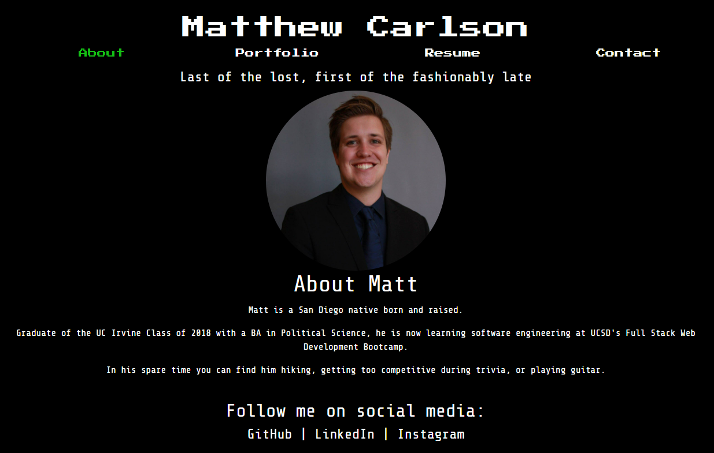

# mc-react-portfolio

## About
This is an updated portfolio of mine made in ReactJS.  It contains a portfolio page with six of my projects, as well as a resume and contact page.  

This was a project I had a lot of fun with.  ReactJS is one of the more interesting topics I've learned about in class so I enjoyed playing with it.  It was challenging working with the small differences, as centering and sizing my resume was pretty difficult.

However, I'm proud of what I created and can't wait to keep building on it to show off to my future employer.

## Contributors:
I wrote the code but received help from my TA Michael and some kind BCS tutors.

In addition, I utilized some outside help for this assignment.  Geeks for Geeks helped with my headers.  [The article is here.](https://www.geeksforgeeks.org/how-to-create-header-in-react-js/)  Addtionally, I utilized help from a YouTuber named DEVAMS for my hamburger menu, [here is the video I watched that helped.](https://www.youtube.com/watch?v=Et5tDPoU03c) 

## Testing
To use my app, simply open it and navigate through the pages.  [You can find a link to the site here.](https://mrmrc182.github.io/mc-react-portfolio/)  The user is able to see my projects by clicking on the thumbnail images, and can see the code by visiting the links to each apps GitHub repository.  Below is a screenshot of the portfolio's homepage.

## License:
Matt Carlson Code 2022
